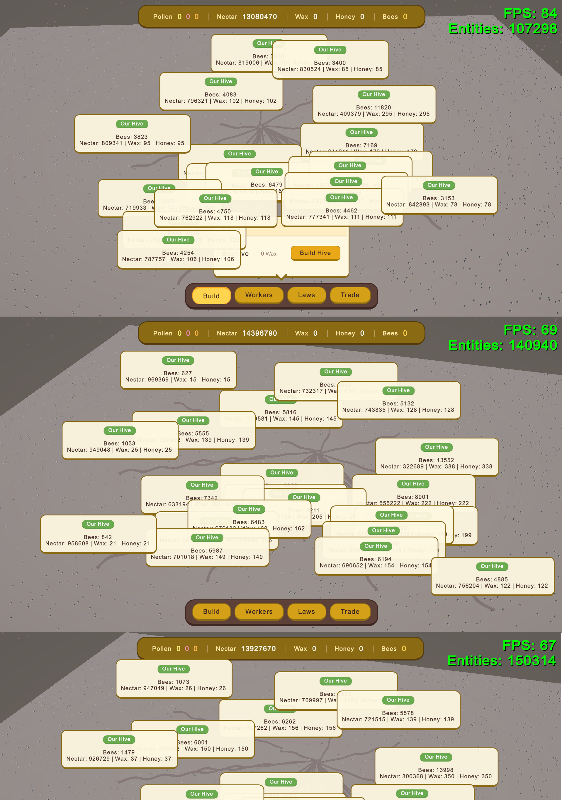

# Hi! My name is Piotr and I am a Game Developer!
I'm a programmer from Bytów, Poland, passionate about C++ and low-level architecture.

## Projects

### Custom ECS-based Game Engine (C++ / Raylib)
My main project is a custom game engine where I implemented a Data-Oriented architecture from scratch... *(describe how you implemented Sparse Sets here and why it performs faster, memory contiguousness, cache hits, etc.)*

You can find more of my code on my [GitHub](https://github.com/Marakuja15).

---

### Unity DOTS Bee Colony Strategy
An ambitious real-time strategy and simulation game built entirely using **Unity's Data-Oriented Technology Stack (DOTS)**. The goal was to simulate a massive, complex bee colony with thousands of independent units, a functioning economy, and dynamic laws, all running at high frame rates.

#### What I Implemented
* **High-Performance ECS Architecture:** Fully utilized the C# Job System and Burst Compiler to multithread thousands of bees simultaneously.
* **Grid-Based Spatial Hashing:** Implemented a custom grid system for a "Fog of War" mechanic and highly optimized flower discovery for resource gathering.
* **Complex State Management:** Built AI behaviors for different roles (e.g., Scouts discovering new terrain, Pollen Collectors gathering resources) using ECS enableable components and dynamic tagging.
* **Virtual Population & Economy:** Designed a background economy simulation managing nectar, wax, and population growth (handling thousands of virtual citizens before instantiating them as physical entities to save memory).
* **Global Laws System:** A dynamic regime system where changing a law (e.g., "Military Law") instantly modifies the components and behaviors of thousands of active entities in real-time.
#### Images

* The game easily handles over 100 thousand moving and interacting entities (flowers and bees).
*Note on Graphics/UI: I am a low-level programmer, not an artist. All game UI (built with UI Toolkit) and 3D assets were primarily AI-generated or used as placeholders to allow me to focus strictly on coding the engine logic.*

#### Unfinished Features & Planned Scope
The original Game Design Document included a massive array of mechanics:
* Deep combat mechanics involving City Defenders and enemy invasions.
* Complex societal management, including taxes, education limits, and various political regimes.
* Multi-hive territory control and procedural biome generation.

#### Why The Project Was Halted
I ultimately decided to step away from this project because the scope became overwhelmingly large for a solo developer. My ambitions for the grand-strategy aspects outgrew my available time. However, building this simulation served as a fantastic, deep dive into memory management, multithreading, and the complexities of the Unity DOTS environment. 

It taught me invaluable lessons about project scoping and low-level optimization that I now apply to my C++ engine development.

You can find this repository on my [GitHub](https://github.com/Marakuja15/Unity-Dots-BeeStrategy/tree/main).